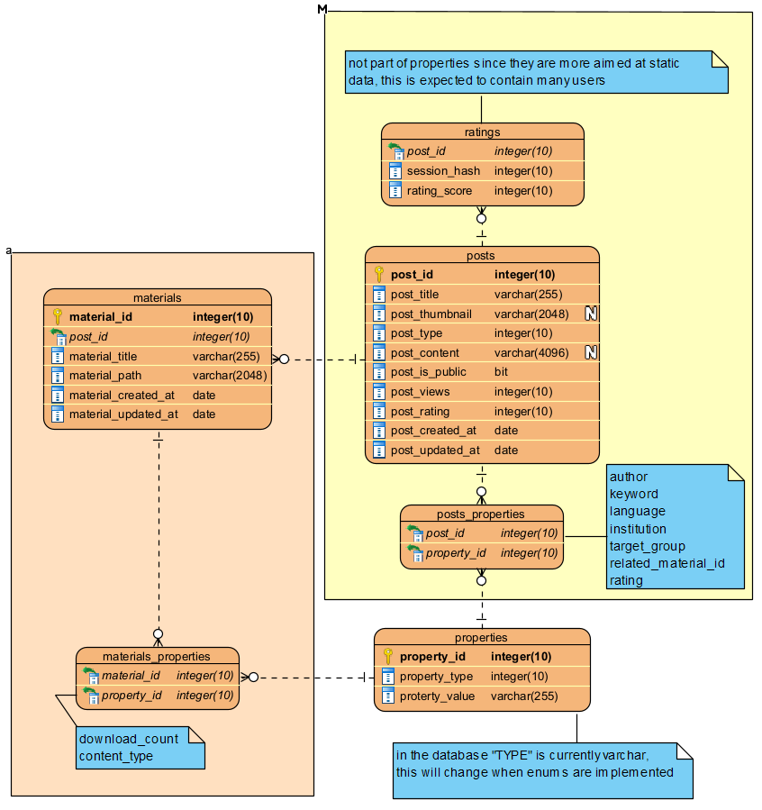

# Interactive database of educational materials on academic integrity

---

Author: [Jan Martinek](https://is.muni.cz/auth/osoba/484967)
Lead: [Mgr. Tomáš Foltýnek, Ph.D.](https://is.muni.cz/auth/osoba/4374)
Consultant: [Ing. Dita Dlabová, Ph.D.](https://is.muni.cz/auth/osoba/didl)

NOTE: for now written in .md format, since it is faster and easier to work with
NOTE: this thesis is planned to be written in English

---

## Contents

---

## Introduction

### Overview

It's a known fact that nowadays the world is largely interconnected, it does not matter whether it is by means of easier transportation, telecommunication or the internet to which more than 63 percent of all people have access to. With this connection it is possible to observe many positive changes, such as an easy and fast distribution or exchange of information,  and also drawbacks. The one that plagues many people across the whole digitalized society is information overload. Infromation overload can be defined as a phenomenom that occurs when one has access to more informations than they can handle. It happens on daily basis, affecting practically everyone, be it general public or the academics one. In particular students and teachers form a group of people that use the internet for their studies, and it can be hard to filter useful information from worthless. It needs to be taken into account that not every institution is able to provide its own library of digital materials.

With that being the case, how can the scope be reduced to help alleviate this negative, whilst still retaining the positives?

### Objectives

The goal of the thesis was to remake an existing wordpress plugin of an interactive database for educational materials into a standalone PhP application. The application was created for use by an organization called European Network on Academic Integrity, or ENAI in short.

The application will provide both an easy to use administration and

### Methodology

---

## Analysis and design

### Functional requirements

### Non-functionar requirements

### Use case model

### Data model

---

## Implementation

### Frameworks

### Project structure

### Public area

### Administration

---

## Conclusion

---

## Literature

---

## Attached files
